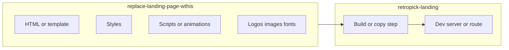
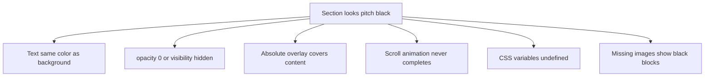

# Retropick landing rebrand and visibility fix

**Note:** Codebase tools were unavailable during planning, so file-level line citations could not be verified. The first implementation step should be a quick inventory of [`apps/retropick-landing/sources/replace-landing-page-wthis/`](apps/retropick-landing/sources/replace-landing-page-wthis/) before applying changes.

## Goals

1. Replace all **Exchange** branding/copy/assets with **Retropick** across the landing source folder.
2. Fix **Process** and **Rewards** sections that currently render as pitch black with no visible content.

## Phase 1: Inventory and integration map

Scan the folder and parent app to understand how this source is wired in:

- List all files under [`replace-landing-page-wthis/`](apps/retropick-landing/sources/replace-landing-page-wthis/) (HTML, CSS, JS/TS, images, fonts, config).
- Find how the landing app consumes this folder (e.g. import path, build copy step, or static serve) in [`apps/retropick-landing/`](apps/retropick-landing/).
- Grep for case variants: `exchange`, `Exchange`, `EXCHANGE`, filenames like `exchange-*`, and logo/asset paths.

## Phase 2: Exchange to Retropick rebrand (systematic pass)

Apply replacements in this order to avoid broken asset references:

| Category | What to change | Examples |
|----------|----------------|----------|
| Visible copy | Headings, nav, hero, CTAs, footer | "Exchange" → "Retropick" |
| Meta / SEO | `<title>`, `og:title`, description | Product name strings |
| Code identifiers | Only if they are user-facing or safe to rename | Prefer keeping internal IDs unless exported |
| Assets | Logos, favicons, alt text | Rename files + update all `src`/`url()` refs |
| CSS | `content:` in pseudo-elements, font-family labels | Any exchange-named custom properties |
| Config | Package name, env defaults, comments in HTML | Leftover template strings |

**Naming conventions to align on:**
- Product name in UI: **Retropick** (capital R, one word unless design uses "RetroPick").
- URLs/slugs: `retropick` (lowercase).
- Do **not** blindly replace substrings inside unrelated words (e.g. `exchangeRate` if it is a real API term).

**Checklist after rebrand:**
- No remaining `exchange` strings in user-visible text (grep verification).
- All image/font paths resolve (no 404s in network tab).
- Browser tab title and social preview show Retropick.

## Phase 3: Diagnose pitch-black Process and Rewards sections

Pitch black with **invisible** content (sections still in DOM, scroll height exists) usually comes from one of these:

### 3a. Locate section markup and styles

Find components/sections named or id'd like `process`, `rewards`, `how-it-works`, `steps`, etc. For each:

- Note `background`, `color`, `opacity`, `mix-blend-mode`, `filter`, `z-index`.
- Check parent wrappers for `overflow: hidden` + negative transforms that clip text.
- Check for dark theme classes (e.g. `text-black` on `bg-black`, or `color: #000` on `#000`).

### 3b. Common fixes (apply what matches the code)

1. **Contrast:** Set explicit text colors on section and children, e.g. `color: var(--foreground)` or a light gray on dark backgrounds — not inherited black.
2. **CSS variables:** If styles use `var(--exchange-*)` or theme tokens from the old template, map them to Retropick tokens or hardcode fallbacks until tokens exist.
3. **Overlays:** Look for `::before`/`::after` or `.overlay` with `position: absolute; inset: 0; background: #000` sitting above content — lower z-index on overlay or raise content (`position: relative; z-index: 1`).
4. **Scroll / GSAP / AOS animations:** If elements start at `opacity: 0` and animate in on scroll, a broken observer or missing library leaves them invisible. Fix: ensure animation init runs, or add a no-JS fallback (`opacity: 1` when `prefers-reduced-motion` or when script fails).
5. **Images/video:** Black placeholders when `src` points to old `exchange-*` assets — update paths after rebrand.
6. **Blend modes:** `mix-blend-mode: multiply` on dark backgrounds can erase text — remove or adjust.

### 3c. Verify in browser

- DevTools → select Process/Rewards nodes: confirm text nodes exist and computed `color` vs `background-color`.
- Toggle `opacity` / `visibility` in Styles panel to confirm animation state.
- Network tab: failed CSS/JS/font requests.
- Console: JS errors blocking animation init.

## Phase 4: Wire-up and regression checks

- Run the landing app dev server and load the page built from this source.
- Visual pass: Hero, **Process**, **Rewards**, footer — all readable on intended background.
- Responsive: mobile widths (stacked layouts often hide text via `height: 0` or `clip-path`).
- Accessibility: contrast ratio for body text on dark sections (WCAG AA where possible).

## Suggested file touch order (typical structure)

Exact filenames TBD after inventory; expect something like:

1. Main HTML/template in [`replace-landing-page-wthis/`](apps/retropick-landing/sources/replace-landing-page-wthis/)
2. Global + section CSS (Process/Rewards rules)
3. Section JS / animation entry
4. Assets directory (logos, section illustrations)
5. Parent app config if it references "exchange" in routes or env

## Risk areas

- **Substring replacements** breaking URLs or npm package names — use targeted replacements per file type.
- **Animation dependency** — fixing CSS alone may not help if JS never runs; check script load order.
- **Duplicate styles** — old Exchange theme in one file overriding Retropick fixes in another; grep `process` and `rewards` across all CSS files.

## Success criteria

- Zero user-facing "Exchange" branding in the landing source.
- Process and Rewards sections show headings, body copy, and visuals with clear contrast.
- No console errors or 404 assets on page load.
